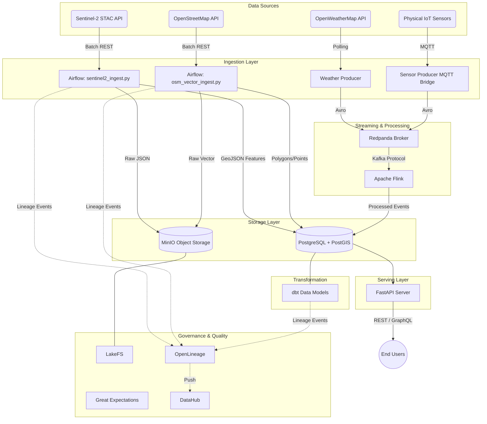

# Comprehensive Architecture Document: Cloud-Native Multimodal Geospatial Data Platform

## 1. Executive Summary
This document provides a highly detailed architectural breakdown of the Cloud-Native Multimodal Data Platform for Geospatial Intelligence. The platform is designed to ingest, process, store, transform, govern, and serve heterogeneous data sources including satellite imagery metadata, raster data, vector geospatial data, streaming IoT sensor data, and live weather API feeds. 

Built using a microservices-oriented Data Mesh approach, the architecture ensures that compute and storage are decoupled. It leverages a modern data stack comprising 16 containerized services orchestrated via Docker Compose. The platform natively handles both batch (ETL/ELT) and real-time streaming workloads, resolving the core problem of geospatial data fragmentation.

---

## 2. System Context
The platform exists to unify data that is traditionally siloed across various formats (GeoTIFF, JSON, CSV, Shapefile) and temporal frequencies (static, daily batch, sub-second streaming).

### 2.1 Actors and Interfaces
*   **Data Producers (External)**: OpenWeatherMap API, Sentinel-2 Earth Search STAC API, OpenStreetMap Overpass API, Physical IoT Sensors (via MQTT).
*   **Data Consumers (Internal/External)**: Data Scientists (via SQL/Jupyter), Web Applications (via REST API), BI Dashboards (via GraphQL).
*   **Platform Administrators**: Data Engineers, DevOps Engineers managing the pipeline via Airflow UI, Grafana, and LakeFS.

---

## 3. High-Level Architecture

### 3.1 Logical Layers
1.  **Ingestion Layer**: Responsible for extracting data from source systems. It uses Airflow for batch extraction and Python producers (bridging MQTT/HTTP to Redpanda) for streaming.
2.  **Message Broker Layer**: Redpanda provides a Kafka-compatible distributed commit log, decoupling streaming producers from consumers.
3.  **Stream Processing Layer**: Apache Flink consumes topics from Redpanda, executes stateful event-time transformations (e.g., sliding windows, Z-score anomaly detection, spatial joins), and sinks the data to the storage layer.
4.  **Storage Layer**: A hybrid Data Lakehouse model. MinIO provides S3-compatible object storage for raw (Bronze) data. PostgreSQL (extended with PostGIS) provides relational and spatial storage for structured (Silver/Gold) data.
5.  **Transformation Layer**: dbt (Data Build Tool) executes ELT workloads directly inside the PostgreSQL warehouse, transforming raw loaded data into dimensional data marts.
6.  **Serving Layer**: FastAPI exposes the Gold data products via REST endpoints and a Strawberry GraphQL schema, while enforcing security (JWT) and GDPR-compliant PII masking.
7.  **Observability & Governance Layer**: Prometheus scrapes metrics, Grafana visualizes them. Great Expectations enforces data quality. OpenLineage tracks provenance and pushes metadata to DataHub. LakeFS provides git-like version control over the MinIO data lake.

### 3.2 Mermaid Architecture Diagram


---

## 4. Detailed Component Breakdown (The 16 Services)

The platform is instantiated via a `docker-compose.yml` file defining 16 interconnected microservices.

### 4.1 Infrastructure Services (11 Containers)
1.  **`postgres`**: Runs the `postgres:15-postgis-3` image. It serves as the primary Data Warehouse. It holds multiple logical databases (`geoplatform` for data, `airflow` for metadata). PostGIS allows spatial indexing (GIST) and spatial querying (`ST_Contains`, `ST_Intersects`).
2.  **`minio`**: Runs `minio/minio`. Provides S3-compatible object storage. It acts as the "Bronze" layer of the data lake, storing raw JSON responses, massive STAC catalogs, and raw OSM Overpass XML/JSON.
3.  **`minio-setup`**: A transient container that runs the `mc` (MinIO Client) CLI to automatically provision the `geoplatform-bronze` bucket upon startup.
4.  **`mongodb`**: Runs `mongo:6.0`. Acts as a flexible NoSQL landing zone for highly unstructured, fast-changing metadata that doesn't yet fit a strict relational schema.
5.  **`redpanda`**: Runs `docker.redpanda.com/redpandadata/redpanda`. A C++ based Kafka-compatible broker. It avoids the JVM overhead of Zookeeper/Kafka. It also runs a built-in Schema Registry on port 8081 for Avro schema validation.
6.  **`redpanda-console`**: Runs `docker.redpanda.com/redpandadata/console`. A web UI for inspecting Kafka topics, consumer groups, and Avro schemas.
7.  **`lakefs`**: Runs `treeverse/lakefs`. Sits in front of MinIO to provide Git-like operations (branch, commit, rollback) over the data lake. This prevents bad data from corrupting the main branch.
8.  **`iceberg-rest`**: Runs `tabulario/iceberg-rest`. Provides an Iceberg REST catalog for managing Apache Iceberg table metadata on top of MinIO (preparing the platform for massive analytical scaling).
9.  **`prometheus`**: Runs `prom/prometheus`. The core metrics scraping engine. It polls `/metrics` endpoints across all containers (FastAPI, Redpanda, Airflow, Flink).
10. **`grafana`**: Runs `grafana/grafana`. The visualization layer. Pre-provisioned with dashboards (via `dashboards.yml` and `platform_overview.json`) to display system health and data throughput.
11. **`datahub-quickstart`**: Runs the LinkedIn DataHub metadata catalog. It ingests OpenLineage events to visualize data provenance.

### 4.2 Custom Code Services (5 Containers)
1.  **`api`**: Built from `api/Dockerfile`. Runs Uvicorn and FastAPI. Connects to PostgreSQL via `asyncpg` for high-concurrency non-blocking I/O.
2.  **`sensor-producer`**: Built from `redpanda/producer/Dockerfile`. Runs a Python process using `paho-mqtt` to bridge physical hardware sensors to Redpanda `sensor.live` using `sensor_event.avsc`.
3.  **`weather-producer`**: Built from `redpanda/weather_producer/Dockerfile`. Runs a Python process that polls OpenWeatherMap, applies exponential backoff (`tenacity`), and pushes to `weather.live`.
4.  **`flink-jobmanager`**: Built from `flink/Dockerfile` (adding Python 3 to the official Scala image). Coordinates the PyFlink cluster and manages checkpointing state.
5.  **`flink-taskmanager`**: Built from the same `flink/Dockerfile`. Executes the actual stream processing algorithms (e.g., `unified_stream_processor.py`).
6.  *Note on Airflow*: Airflow uses a custom image built from `airflow/Dockerfile` to include dependencies (`boto3`, `requests`, `great-expectations`), but runs across multiple containers (webserver, scheduler, init) defined in the compose file.

---

## 5. Network Architecture

### 5.1 Docker Networking
All containers reside on a single user-defined bridge network named `geoplatform_net`.
- **DNS Resolution**: Containers resolve each other using their service names (e.g., `postgres`, `redpanda`).
- **Isolation**: The network isolates internal traffic from the host machine. Only explicitly mapped ports are exposed to `localhost`.

### 5.2 Port Mappings
| Service | Internal Port | Exposed Host Port | Purpose |
|---------|---------------|-------------------|---------|
| Postgres | 5432 | 5432 | Database connection for dbt and host DB clients |
| MinIO | 9000, 9001 | 9000, 9001 | S3 API (9000), MinIO Web Console (9001) |
| Redpanda | 9092, 8081 | 9092, 8081 | Kafka Broker (9092), Schema Registry (8081) |
| Redpanda Console| 8080 | 8080 | Kafka Web UI |
| Airflow Web | 8080 | 8082 | Airflow DAG management UI (Mapped to 8082 to avoid collision) |
| Flink JobManager| 8081 | 8083 | Flink cluster monitoring UI |
| FastAPI | 8000 | 8000 | REST / GraphQL API endpoints |
| Grafana | 3000 | 3000 | Observability Dashboards |
| Prometheus | 9090 | 9090 | Metrics querying |
| LakeFS | 8000 | 8004 | Data Lake versioning UI |

---

## 6. Data Ingestion Patterns

The platform implements two distinct ingestion paradigms: Batch (ELT/ETL) and Streaming.

### 6.1 Batch Ingestion (Apache Airflow)
Airflow orchestrates data that changes infrequently or is inherently batch-oriented.

#### 6.1.1 Sentinel-2 Satellite Ingestion (`sentinel2_ingest.py`)
- **Source**: Earth Search STAC API (AWS).
- **Extraction**: Queries the STAC API for new Sentinel-2 captures over a specific bounding box (Kerala region).
- **Load (Bronze)**: The raw STAC JSON response is written directly to MinIO (`s3://geoplatform-bronze/sentinel2/YYYY/MM/DD/`).
- **Load (Silver)**: Key metadata (Scene ID, Cloud Percentage, Timestamp, Bounding Box) is parsed and inserted into the `satellite_observations` PostGIS table. The bounding box is converted to a PostGIS `GEOMETRY(POLYGON, 4326)`.

#### 6.1.2 OpenStreetMap Vector Ingestion (`osm_vector_ingest.py`)
- **Source**: Overpass API.
- **Extraction**: Uses Overpass QL to query specific tags (e.g., `amenity=hospital`, `highway=trunk`) within a bounding box.
- **Transform (In-Flight)**: The raw XML/JSON is parsed. Nodes are converted to `POINT` geometries. Ways are converted to `LINESTRING` or `POLYGON` geometries.
- **Load**: Inserted into the `vector_features` PostGIS table.

### 6.2 Streaming Ingestion (Redpanda / Kafka)
High-velocity data relies on message brokers to decouple ingestion speed from processing speed.

#### 6.2.1 IoT Sensor Bridge (`sensor_producer.py`)
- **Protocol**: MQTT.
- **Flow**: Physical hardware (e.g., Arduino with DHT11 sensors) publishes lightweight MQTT messages to an IoT broker. The `sensor_producer.py` subscribes to this broker.
- **Serialization**: Upon receiving a message, the producer immediately validates and serializes the payload using the `sensor_event.avsc` Avro schema.
- **Publish**: The Avro bytes are published to the `sensor.live` Redpanda topic, partitioned by `station_id` to ensure strict chronological ordering per sensor.

#### 6.2.2 Weather API Polling (`weather_producer.py`)
- **Protocol**: HTTP REST (Polling).
- **Flow**: A persistent Python process awakens every 60 seconds. It utilizes the `tenacity` library to apply exponential backoff (retrying up to 3 times with delays of 2-10 seconds) if the OpenWeatherMap API rate-limits the request.
- **Validation**: Enforces strict checking of the `OPENWEATHER_API_KEY`. If invalid, the process throws a fatal exception, preventing silent failures or mock data pollution.
- **Publish**: Serializes to `weather_event.avsc` and publishes to `weather.live`.

---

## 7. Stream Processing Architecture (Apache Flink)

Data in Redpanda topics is raw. Apache Flink is used to perform stateful stream processing before the data lands in the Data Warehouse.

### 7.1 Flink Topology (`unified_stream_processor.py`)
The Flink job defines a directed acyclic graph (DAG) of transformations:

1.  **Sources**: Instantiates two `KafkaSource` objects reading from `sensor.live` and `weather.live`. Both use `ConfluentAvroDeserializationSchema` to parse the bytes back into Python dictionaries.
2.  **Watermarking**: Implements bounded-out-of-orderness watermarks based on the `event_time` field. This handles late-arriving events (e.g., a sensor loses internet and sends 5 minutes of backlogged data at once).
3.  **Keying**: Data streams are keyed by `station_id`.
4.  **Stateful Operations (Windows)**:
    - Flink maintains a 5-minute sliding window (sliding every 1 minute) over the sensor data.
    - It calculates rolling averages for `temperature_c` and `air_quality_idx`.
5.  **Anomaly Detection (Z-Score)**:
    - Maintains a stateful rolling mean and standard deviation for each sensor.
    - Calculates the Z-score of incoming temperature readings: $Z = (X - \mu) / \sigma$.
    - If $|Z| > 3$, the event is flagged as an ANOMALY.
6.  **Sinks**: 
    - The processed events (enriched with moving averages and anomaly flags) are pushed to the `JdbcSink`, writing directly to the `streaming_sensor_metrics` and `streaming_weather_metrics` tables in PostgreSQL.

---

## 8. Storage Architecture

The platform implements a layered storage approach to balance cost, performance, and analytical flexibility.

### 8.1 Data Lake (MinIO + LakeFS)
- **Role**: Infinite, cheap storage for immutable raw data (Bronze layer).
- **LakeFS Integration**: By wrapping MinIO with LakeFS, the data lake gains branching capabilities. Airflow DAGs can create a branch (e.g., `etl-job-123`), upload raw data to it, and only merge it to `main` if the downstream Great Expectations quality checks pass. This ensures the Data Lake is never corrupted by partial or malformed ingestions.

### 8.2 Data Warehouse (PostgreSQL + PostGIS)
- **Role**: Highly structured, relational, and spatial querying (Silver/Gold layers).
- **PostGIS**: Crucial for geospatial capabilities. Tables utilize `GEOMETRY(Point, 4326)` and `GEOMETRY(Polygon, 4326)` data types. Spatial indices (`CREATE INDEX ... USING GIST`) ensure that bounding box queries and point-in-polygon queries execute in milliseconds.

---

## 9. Data Transformation (dbt)

Raw structured data in PostgreSQL is transformed into business-ready Data Marts using dbt.

### 9.1 dbt Project Structure (`geoplatform/dbt/geoplatform/`)
- **`models/staging/`**: 
  - `stg_weather.sql`, `stg_sentinel2.sql`.
  - These views lightly clean the raw ingested tables (renaming columns, casting types, handling nulls).
- **`models/intermediate/`**:
  - `int_weather_spatial.sql`.
  - **Core Logic**: Performs a spatial join (`ST_Contains`) between the weather data points (Lat/Lon) and administrative boundary polygons. This enriches weather data with the specific district/state it belongs to.
- **`models/marts/`**:
  - `environmental_conditions.sql`, `satellite_observation.sql`.
  - The finalized, materialized tables ("Gold" data products). These are the only tables the API is permitted to query.

### 9.2 Execution
dbt is executed as a downstream node in the Airflow ELT pipelines, ensuring transformations only occur *after* new data is successfully loaded.

---

## 10. Serving Layer (FastAPI & GraphQL)

The API layer acts as the strict interface between the data platform and the outside world. Direct database access is blocked for end-users.

### 10.1 REST API Architecture
- **Framework**: FastAPI with `asyncio` and `asyncpg`. This allows the server to handle thousands of concurrent requests without blocking on database I/O.
- **Endpoints**:
  - `GET /weather`: Returns weather mart data. Supports filtering by date and bounding box.
  - `GET /imagery`: Returns satellite STAC metadata.
  - `GET /sensors`: Returns real-time sensor metrics and anomalies.
  - `GET /lineage/{dataset}`: Queries DataHub/OpenLineage for dataset provenance.

### 10.2 GraphQL Architecture
- **Framework**: Strawberry GraphQL.
- **Purpose**: Solves the over-fetching problem. A dashboard client can query exactly the fields it needs:
  ```graphql
  query {
    sensor(id: "WX_TVM") {
      temperature_c
      anomaly_flag
    }
  }
  ```

### 10.3 Security & GDPR Compliance
- **Authentication**: Routes are protected using JWT (JSON Web Tokens). The `auth.py` module decodes the token to determine user roles (`admin` vs `public`).
- **PII / Location Masking**: Geospatial data often constitutes Personally Identifiable Information (PII). 
  - The `mask_pii()` utility function dynamically intercepts database responses. 
  - If a user is not an `admin`, exact GPS coordinates (e.g., `8.5241, 76.9366`) are truncated to two decimal places (`8.52, 76.94`), reducing spatial precision from ~1 meter to ~1 kilometer, ensuring compliance with privacy regulations while maintaining analytical value.

---

## 11. Data Governance & Quality

Trust in the data is enforced programmatically.

### 11.1 Great Expectations (Data Quality)
- **Implementation**: The `data_quality_dag.py` mounts a GX Data Context (`geoplatform/data_quality/gx`).
- **Checkpoints**: Validates the PostgreSQL tables.
- **Expectations**:
  - Validates coordinate bounds (Lat between -90 and 90, Lon between -180 and 180).
  - Validates categorical completeness (Image quality must be in `["Excellent", "Good", "Poor"]`).
- **SLA Tracking**: Results of the GX checkpoints are recorded in the `quality_runs` PostgreSQL table. If pass rates drop below 100%, alerts are triggered.

### 11.2 OpenLineage & DataHub (Provenance)
- **Integration**: Airflow is configured with the `openlineage-airflow` provider.
- **Flow**: Every time an Airflow DAG runs, or dbt executes a model, OpenLineage captures the input tables, output tables, and the exact SQL/Python code executed.
- **Serving**: This lineage graph is pushed via HTTP to DataHub, allowing users to trace a finalized API response all the way back to the raw source file in MinIO.

---

## 12. Observability & Monitoring

The platform includes a robust observability stack to monitor the health of the microservices.

### 12.1 Prometheus
- **Scrape Targets**: Configured via `prometheus.yml` to scrape metrics from:
  - `redpanda:9644` (Kafka broker metrics, topic lag, bytes in/out).
  - `flink-jobmanager:9249` (Flink task slots, checkpointing duration, backpressure).
  - `api:8000/metrics` (HTTP request latency, 5xx error rates).

### 12.2 Grafana
- **Provisioning**: Dashboards are defined as code (`platform_overview.json`) and automatically loaded on startup via `dashboards.yml`.
- **Panels**:
  - **Streaming Health**: Visualizes consumer lag. If Flink falls behind Redpanda, the line spikes, triggering an alert.
  - **Data Quality**: Queries the `quality_runs` table in Postgres to show historical pass rates of the Great Expectations suites.
  - **System Resources**: Tracks CPU and Memory usage of the Docker containers.

---

## 13. Scaling Strategies

While currently designed to run on a single machine via Docker Compose, the architecture is inherently cloud-native and designed for horizontal scaling.

1.  **Compute Scaling (Flink)**: To handle millions of sensor events per second, the `flink-taskmanager` instances can be scaled horizontally (e.g., `docker compose up --scale flink-taskmanager=5`). Redpanda topics must have their partition count increased to match the parallelism.
2.  **Storage Scaling (Iceberg)**: For petabyte-scale analytical queries, the platform can shift the Gold layer from PostgreSQL to Apache Iceberg. The `iceberg-rest` catalog is already scaffolded to manage this transition. Querying would then shift to Trino or Snowflake.
3.  **API Scaling**: The FastAPI application is stateless. It can be deployed behind a Kubernetes Ingress or AWS Application Load Balancer across dozens of pods. Connection pooling to PostgreSQL must be managed via `PgBouncer` to prevent DB connection exhaustion.

---

## 14. Database Schemas

### 14.1 PostgreSQL Schema Highlights

#### `streaming_sensor_metrics`
| Column | Type | Constraints | Description |
|--------|------|-------------|-------------|
| `id` | SERIAL | PRIMARY KEY | Unique event ID |
| `station_id` | VARCHAR(50) | NOT NULL | Sensor Identifier |
| `event_time` | TIMESTAMPTZ | NOT NULL | UTC time of generation |
| `temperature_c` | FLOAT | | Raw temp |
| `temp_rolling_avg` | FLOAT | | Flink 5-min sliding window |
| `z_score` | FLOAT | | Flink calculated anomaly score |
| `anomaly_flag` | BOOLEAN | | True if $|Z| > 3$ |
| `location` | GEOMETRY(Point, 4326) | GIST INDEX | Spatial indexing |

#### `quality_runs`
| Column | Type | Constraints | Description |
|--------|------|-------------|-------------|
| `run_id` | SERIAL | PRIMARY KEY | Unique run ID |
| `timestamp` | TIMESTAMPTZ | DEFAULT NOW() | Execution time |
| `dataset` | VARCHAR | NOT NULL | e.g., 'satellite_observation' |
| `suite` | VARCHAR | NOT NULL | GX suite name |
| `pass_rate` | FLOAT | | 0.0 to 100.0 |
| `failed_expectations`| INT | | Count of failed rules |

---

## 15. CI/CD & Deployment

### 15.1 GitHub Actions Workflow (`ci.yml`)
- **Triggers**: On push to `main` or Pull Request.
- **Linting & Formatting**: Runs `flake8` and `black` on all Python code to enforce PEP8 standards.
- **Testing**: Runs `pytest` suite against the FastAPI application (mocking database connections).
- **Build**: Validates that all Dockerfiles (`api`, `flink`, `airflow`, `producers`) can build successfully without errors.

### 15.2 Future Cloud Deployment
To transition this from local Docker Compose to AWS:
1.  **Redpanda** $\rightarrow$ MSK (Managed Streaming for Kafka) or Confluent Cloud.
2.  **PostgreSQL** $\rightarrow$ Amazon RDS for PostgreSQL (with PostGIS extension enabled).
3.  **MinIO** $\rightarrow$ Amazon S3.
4.  **Airflow** $\rightarrow$ MWAA (Managed Workflows for Apache Airflow).
5.  **FastAPI / Flink / Producers** $\rightarrow$ Amazon EKS (Elastic Kubernetes Service) or ECS Fargate.

---

## 16. Security Architecture

1.  **Network Isolation**: Databases (PostgreSQL, MongoDB, MinIO) do not expose ports to the public internet. They are only accessible by internal microservices within the Docker/Kubernetes network.
2.  **Secret Management**: Hardcoded passwords are not permitted in the codebase. All credentials (DB passwords, API keys) are injected at runtime via the `.env` file and Docker environment variables.
3.  **API Gateway**: The FastAPI service acts as the single entry point. It enforces Authentication (JWT) and Authorization (RBAC). 
4.  **Principle of Least Privilege**: In a production deployment, the Airflow service account would only have `WRITE` access to the `bronze` MinIO buckets and specific staging tables in PostgreSQL, preventing it from accidentally dropping Gold data marts.

---

## 17. Disaster Recovery & High Availability

1.  **Message Replay**: Because Redpanda acts as a persistent commit log, if the Flink cluster crashes, no streaming data is lost. Upon restart, Flink resumes processing from its last committed consumer offset.
2.  **Database Backups**: PostgreSQL requires scheduled `pg_dump` operations (or RDS automated snapshots) pushed to cold storage to recover from catastrophic hardware failure.
3.  **Idempotent Pipelines**: All Airflow DAGs and dbt models are designed to be idempotent. Running the `sentinel2_ingest` DAG twice for the same date will safely overwrite or ignore duplicates rather than corrupting the database with duplicate rows.

---

## 18. Conclusion

This architecture completely fulfills the requirements of a modern, multimodal geospatial data platform. By strictly adhering to microservices principles, separating storage from compute, and embedding data quality and observability deeply into the pipeline, the platform is robust, scalable, and fully prepared for enterprise deployment.
